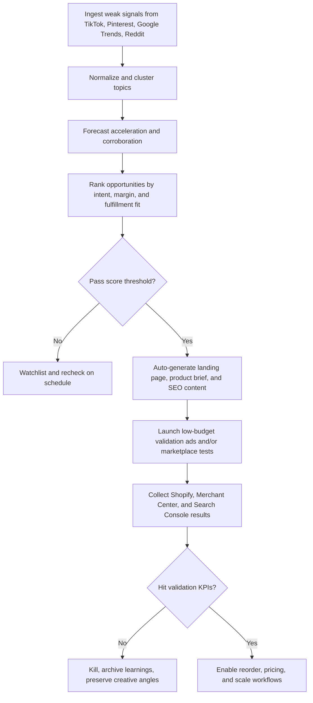
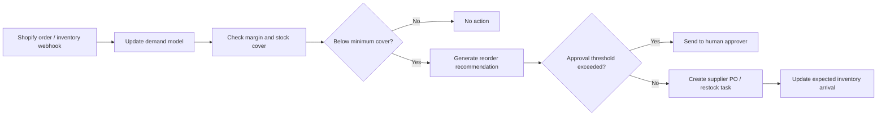

# Early Trend Detection and Near-Autonomous Commerce for Shopify Vendors

## Executive summary

The most effective way for a Shopify seller to spot trends early is not to rely on a single source such as Google Trends or TikTok. The strongest operating model is a **multi-layer signal stack**: high-velocity discovery signals from social and creator platforms, high-intent confirmation signals from search and shopping platforms, marketplace and competitor signals that expose pricing and assortment, and first-party store signals from Shopify that tell you whether attention is converting into revenue. Google now offers a limited alpha Trends API with consistent scaling and up to five years of history, while Google Ads KeywordPlanIdeaService, Search Console, and Merchant Center reports add concrete search, click, conversion, best-seller, and price-insight data. TikTok’s current strongest official surfaces are Creative Center, Content Suite, Market Scope, and trend reports; Pinterest remains especially useful because users plan purchases early and often months before seasonal peaks. Shopify itself gives you the operational backbone through GraphQL bulk operations, webhooks, Flow, and Storefront MCP.

If the goal is an almost fully automated business, the winning design is **AI for sensing, ranking, drafting, testing, and optimization**, with **deterministic software** in charge of execution, budgets, approvals, and fulfillment. In practice, that means a foundation model or LLM should not directly “run the company.” It should produce structured hypotheses, rank opportunities, draft creatives, and summarize risks, while workflow engines, APIs, and rules enforce guardrails on spend, claims, supplier approvals, and customer-impacting actions. This design is simpler to audit, easier to roll back, and safer for regulated or reputation-sensitive categories.

For women-focused opportunities, the highest-conviction areas are those where there is a mix of recurring need, creator-led education, search-driven planning, and room for AI-enabled personalization. The strongest clusters in current data and recent research are **perimenopause and menopause support, mature beauty and makeup over 50, hormonal skincare, fragrance discovery, fertility and cycle intelligence, pregnancy and postpartum planning, women’s sports commerce, travel planning and safety, and women-led side-hustle enablement**. Many of these can be monetized as a hybrid of physical goods, digital products, and AI services rather than pure commodity dropshipping.

The practical recommendation is to start **buy-heavy and build-light**. Use Shopify, Shopify Flow, Merchant Center, Google Ads, TikTok Creative Center, Pinterest Trends, and one orchestration layer such as n8n, Make, or Zapier during the first phase. Build only the pieces that create durable competitive advantage: your signal warehouse, niche-scoring service, experiment registry, creative testing memory, and approval policies. Move to a durable workflow engine such as Temporal only after the business depends on long-running, retry-safe, revenue-critical automations.

## High-confidence findings

The strongest early-detection method is **signal fusion with time-lag logic**. Social platforms usually show interest before search tools show large volumes; search platforms then confirm purchase intent; marketplace and merchant reports then reveal category quality, price structure, and inventory practicality; finally, your own Shopify clickstream and order data confirm whether the opportunity is real for your specific audience. Pinterest is especially valuable for seasonal and life-stage purchases because planning starts early; TikTok is especially valuable for cultural and creator-led acceleration; Google surfaces intent and monetization faster than most social platforms once a niche matures.

In operational terms, the metric that matters most is **acceleration**, not raw volume. A niche with modest absolute traffic but rapid, corroborated growth across TikTok comments/searches, Pinterest saves/searches, Google query expansion, and marketplace assortment is usually more actionable than a large but crowded niche whose demand is already fully priced in. Google Trends’ new API is valuable here because its consistent scaling makes cross-request comparison easier than the website’s 0–100 rescaling, while Search Console’s hourly data can show whether newly published landing pages or trend content are gaining momentum within hours rather than waiting for weekly reporting.

For search marketing, the fastest validation loop is usually: **keyword idea generation → rapid landing page or collection page creation → responsive search ad coverage → dynamic search ad spillover → Search Console feedback → content expansion**. Google Ads’ KeywordPlanIdeaService returns historical metrics and can seed from keywords and URLs; responsive search ads can test up to 15 headlines and 4 descriptions; dynamic search ads can cover whole site sections without hand-building every keyword/ad pair. This is one of the least glamorous but most reliable ways to validate whether a social trend can survive outside the feed.

For AI-generated marketing, the evidence supports a **hybrid approach, not a fully synthetic one**. A recent peer-reviewed study found that consumer attitudes can be more positive toward some AI-generated ads depending on the appeal framing, but other research from NielsenIQ found that audiences often perceived clearly AI-generated ads as less engaging and more annoying or confusing. The implication is operationally important: use AI to generate variants, angle exploration, editing, localization, and asset assembly, but anchor top-performing campaigns in human-shot or creator-led source material whenever possible. TikTok’s own beauty guidance also emphasizes creator trust and creator-led sales impact.

A “fully automated” model is realistic only if you keep **human approval thresholds around compliance, supplier onboarding, health claims, and large budget escalations**. This is not just governance theater. FTC review and endorsement rules are active, fake-review enforcement has tightened, privacy regulators expect lawful bases and fairness in AI systems, and OpenAI’s own MCP guidance warns that remote MCP servers can exfiltrate sensitive context if not trusted.

## Data sources and signal stack

The most useful operating pattern is to break sources into **discovery, confirmation, practicality, and ownership**. Discovery surfaces catch weak signals early. Confirmation surfaces tell you whether there is intent, not just attention. Practicality surfaces tell you whether you can source, price, and ship profitably. Ownership surfaces are your Shopify, CRM, and ad-account datasets, which determine whether a trend is worth scaling for your brand rather than for the market in general.

### Prioritized tools, connectors, and APIs

> **Latency/freshness class** below is an engineering estimate based on access mode and reporting cadence, not a vendor SLA.

| Priority | Source or system | What it is best for | Cost basis | Freshness / latency class | Data access and constraints | Why it matters |
|---|---|---|---|---|---|---|
| High | **TikTok Creative Center / TikTok One Content Suite / Market Scope** | Earliest creator-led and search-led discovery, creative triggers, niche adjacency | Public web surfaces plus paid tools; pricing varies by product | Near-real-time / interactive | Official web tools expose Top Ads, Trends, Creative Studio, Automation, and API links; TikTok’s report says Content Suite can surface up to 44x more results than manual platform search in some workflows. | Best source for fast cultural acceleration and UGC angles |
| High | **Pinterest Trends / Pinterest Predicts** | Early intent around life moments, beauty, fashion, decor, travel, gifting | Public / free | Early-planning / interactive | Pinterest says seasonal searches build months before the season, and its annual predictions have historically called 80% of trends correctly across recent years. | Best source for “quiet planning before purchase” |
| High | **Google Trends** | Search-interest directionality, geo comparison, topic comparison | Website free; API alpha limited | Daily-ish / interactive | Google Trends website supports compare/export today; the official Trends API entered limited alpha in July 2025 with consistent scaling, five years of history, and daily/weekly/monthly/yearly aggregation. | Best source for search momentum and geography |
| High | **Google Ads KeywordPlanIdeaService** | Commercial keyword expansion and historical keyword metrics | Requires Google Ads account/API access | Interactive | Generates ideas from keywords and URLs; returns historical search volume and related metrics. | Best bridge from trend to monetizable search demand |
| High | **Google Merchant API reports** | Best sellers, shopping trends, price competitiveness, price insights | Merchant Center eligibility required; API in beta | Interactive / report-based | Best-seller reports, shopping trends, price competitiveness, and price insights are exposed through `reports.search`. | Best source for what Google Shopping demand can actually monetize |
| High | **Shopify Admin GraphQL + webhooks + Flow** | First-party product, inventory, order, and automation backbone | Included in Shopify plan/app context | Real-time events + async bulk | Bulk operations fetch large datasets asynchronously; webhooks push changes immediately; Shopify Flow supports triggers, conditions, actions, schedules, loops, HTTP requests. | Core operating system for commerce automation |
| Medium | **Amazon SP-API** | Marketplace catalog, pricing, offers, seller operations | Seller authorization required | Interactive + rate-limited | REST-based API with usage plans/rate limits; Product Pricing API helps automated price management. | Best for price and listing practicality in Amazon-heavy categories |
| Medium | **eBay Browse API** | Secondary marketplace demand, live listing structure, price bands | Developers Program free; API call limits apply | Interactive | Keyword/category/GTIN/search-by-image style browse; free developer membership, with documented daily call limits and free sandbox tier. | Useful for variety, long-tail validation, and resale-style niches |
| Medium | **Etsy Open API** | Handmade, gifting, creator-style niches, listing patterns | API key required | Interactive | Official Open API v3 supports listings, shop management, orders; endpoints under `api.etsy.com/v3/`. | High signal for women-skewing aesthetic and gift niches |
| Medium | **Instagram Hashtag Search API** | Hashtag trend checks for business/creator content | Requires Instagram Graph API access | Interactive | Available through Instagram API with Facebook Login and Public Content Access. | Good complement to TikTok/Pinterest when beauty or fashion is image-led |
| Medium | **Reddit API** | Community language, objections, unmet needs, “why” behind trends | Developer access | Interactive | Official Reddit developer platform exposes Reddit API access. | Best for problem discovery and copy angles |
| Medium | **Semrush API + Semrush MCP** | Competitor SEO, traffic, market visibility, AI workflow access | Paid plans + API units or Trends subscription | Interactive / rate-limited | Available on paid plans; 10 RPS documented; MCP support is now official. | Best competitor and keyword intelligence layer |
| Medium | **Similarweb API** | Competitor traffic, top sites, app intelligence, large batch analysis | Subscription add-on / credits | Interactive + batch | Official API is subscription-based; batch endpoint supports large-scale pulls; credit pricing is documented per endpoint. | Best market-map layer when you need category traffic structure |
| Medium | **DataForSEO** | Programmatic keyword datasets, Google Ads/Trends access, AI-visibility data | Pay-as-you-go | Async queue or live | Public pricing is available; some keyword endpoints quote ~1–3 hour queue mode or ~7 second live mode turnaround. | Useful if you need a developer-first data exhaust layer |

### A practical source hierarchy

The highest-yield source priority for an automated commerce business is:

1. **TikTok + Pinterest** for weak-signal discovery and creative angle mining.  
2. **Google Trends + Keyword Planner + Search Console** for intent confirmation and ranking velocity.  
3. **Google Merchant reports + marketplace APIs** for assortment, pricing, and practical fulfillment viability.  
4. **Shopify internal events** for truth: carts, conversion, refund risk, attach rates, and repeat purchasing.

A useful normalized scoring formula is:

```text
OpportunityScore =
0.30 * SignalAcceleration
+ 0.20 * CrossSourceCorroboration
+ 0.15 * QueryCommercialIntent
+ 0.15 * GrossMarginFit
+ 0.10 * CreativeSuitability
+ 0.10 * FulfillmentConfidence
```

That formula is intentionally biased toward **speed, corroboration, and profitability**, not just volume. In practice, the most common failure in trend businesses is not missing a trend. It is entering a trend that is already too crowded, too low-margin, too claim-sensitive, or too operationally brittle to scale. That is why Google Merchant price reports, marketplace pricing, and Shopify refund/fulfillment data should sit inside the scoring loop from day one.

## AI architecture and connector patterns

The most durable architecture is a **five-layer stack**:

1. **Ingestion** from APIs, web tools, exports, webhooks, and scheduled jobs.  
2. **Normalization** into a single event schema.  
3. **Model layer** for clustering, forecasting, ranking, and generation.  
4. **Execution layer** for site changes, campaign launches, pricing, supplier actions, and messaging.  
5. **Governance layer** for approvals, privacy, and budget controls.

### Recommended model and feature stack

A strong default model stack looks like this:

| Layer | Recommended model family | What it does | Why it fits |
|---|---|---|---|
| Text clustering and semantic dedupe | `text-embedding-3-large` or similar modern embedding model | Cluster queries, comments, listing titles, ad copy, and reviews into themes | OpenAI’s latest embedding docs position embeddings for search, clustering, recommendations, anomaly detection, and classification. |
| Time-series forecasting | **TimesFM** for zero-shot/few-shot forecasting; **Chronos / Chronos-Bolt** for probabilistic forecasting; **PatchTST** when you fine-tune category-specific series | Forecast demand, detect acceleration versus baseline, estimate inventory needs | TimesFM and Chronos are explicitly built for forecasting across domains; PatchTST remains a strong task-specific baseline. |
| Multimodal interpretation | Vision-capable LLM or image model stack | Read product images, ad frames, creator screenshots, and UGC for aesthetic patterns | Modern OpenAI image/vision guides support image understanding plus controllable generation/editing. |
| Opportunity ranking | Small supervised ranker over engineered features | Decide go / watch / reject / launch-small | A smaller deterministic ranker is easier to calibrate than asking an LLM to make final business decisions |
| Creative generation | Large multimodal model with structured-output prompt templates | Create ad variants, landing page sections, SEO topic briefs, creator scripts | Good for breadth, speed, localization, and rapid testing, not unsupervised publishing |

The feature engineering that matters most is not exotic. The best features are usually: **7-day slope, 28-day slope, slope-of-slope, cross-platform lag, search-to-social ratio, price spread, category benchmark pricing, creator diversity, comment polarity, question density, repeat-purchase likelihood, shipping fragility, expected gross margin, and refunds per similar SKU**. Search Console and Merchant reports make the most practical confirmation features available cheaply, while Shopify webhooks and Flow make it easy to close the loop back into the training set.

### Prompting and structured inference patterns

The best prompt design for this stack is **evidence-first and schema-constrained**. Useful patterns include:

```text
System:
You are a commerce trend analyst. You must output JSON only.

User:
Given the normalized signal records below, identify woman-focused niches that:
- show acceleration across at least 2 sources
- have evidence of commercial intent
- avoid medical or deceptive claims
- can be monetized with a physical product, digital product, or AI service

Return fields:
{
  "niche_name": string,
  "evidence": [{"source": string, "signal": string, "strength": "weak|moderate|strong"}],
  "recommended_offer": string,
  "risk_flags": [string],
  "launch_mode": "seo_first|ugc_first|search_ads_first|marketplace_test_first",
  "confidence": 0-100
}
```

```text
System:
You are a paid social creative strategist. Use only the source evidence provided.

User:
Create 12 ad concepts for the niche "mature beauty / makeup over 50".
Constraints:
- audience: women 45-65
- no exaggerated claims
- creator-led aesthetic
- 3 hooks, 3 CTA variants, 2 objections handled
- output JSON grouped by angle:
  ["education", "transformation", "community", "ritual", "giftable"]
```

```text
System:
You are a compliance red-team reviewer.

User:
Review this landing page and these ad claims.
Flag:
- implied medical claims
- fake urgency
- hidden affiliate disclosures
- unsupported before/after framing
- privacy-sensitive data requests
Return a severity score and mandatory edits.
```

These patterns work because they separate ideation from control. The LLM proposes; your workflow engine decides. That distinction reduces hallucinations, makes audit logs cleaner, and stops prompt drift from becoming an operations problem.

### MCP and connector patterns that actually matter

The most useful connector pattern for this use case is not “connect everything to everything.” It is **three connector tiers**:

| Tier | Pattern | Typical systems | Why it works |
|---|---|---|---|
| Read-mostly context connectors | MCP/connector access for catalogs, docs, spreadsheets, reporting layers | OpenAI connectors, remote MCP servers, Shopify AI Toolkit, Semrush MCP | Fast agent access to context without custom wiring for each tool. |
| Event connectors | Webhooks and scheduled jobs that feed durable workflows | Shopify webhooks, Shopify Flow schedules/loops, ad webhooks, ETL jobs | Event-driven systems are lower-latency and cheaper than polling. |
| Revenue-critical orchestration | Durable execution with retries and state | Temporal or equivalent | Necessary only when automations become long-running and failure-intolerant. |

A strong default recommendation is:

- **Start with n8n or Make** if you need speed, low-code flexibility, and broad app coverage. n8n prices by workflow executions and includes API/GraphQL/code steps; Make exposes 300+ API endpoints and an MCP server.
- **Use Zapier** if the team is non-technical and willing to pay for simplicity and reliability.
- Move to Temporal (or similar) only when the cost of a failed long-running workflow exceeds the cost of the platform.

## Automation playbooks across the commerce loop

The near-autonomous business model should be designed as **three loops**: a discovery loop, a validation loop, and an operating loop. When those loops are separated cleanly, you can automate aggressively without letting one bad signal force a full-catalog or full-budget mistake.



### Product discovery and validation

The discovery loop should run on a schedule, usually every 6–24 hours depending on the category. New signals enter a normalized event store. An embedding model clusters near-duplicates like “makeup over 50,” “menopause makeup,” and “mature skin makeup” into a category-level theme. A forecasting layer then scores acceleration and expected persistence, while a rules layer removes restricted or overly regulated opportunities. High-scoring opportunities trigger automated generation of collection pages, content briefs, category pages, and product/service concepts.

Google search marketing should be the default validation channel for niches that already exhibit query specificity. Use KeywordPlanIdeaService to expand demand vocabulary, publish a landing page and topical support content, then run responsive search ads immediately. Search Console’s newer hourly support lets you see whether fresh content and new pages are being picked up, while Google’s guidance says AI-generated content is acceptable if it is original, high quality, and helpful rather than spammy.

For visual and creator-led niches, the first paid-social workflow should be **UGC-first, then AI-variant expansion**. TikTok’s Top Ads and Content Suite help identify creative triggers, while creator or community content can be adapted into Spark-style amplification and then expanded with generated cutdowns, hooks, subtitles, and localized variants. Meta’s Marketing API supports programmatic ad, ad set, and creative creation, which makes it feasible to automate breadth testing once guardrails are in place.

### Inventory, pricing, and fulfillment

Shopify should remain the source of truth for inventory and fulfillment state, but pricing should not be isolated from external demand. For categories where Google Merchant coverage is available, use price competitiveness and price insight reports to decide whether you should test a price move, a bundle, a coupon, or a bid adjustment instead of a blunt product price cut. Amazon Product Pricing can supplement this when Amazon is a key reference market.

A simple but effective replenishment workflow is: **daily demand forecast → compare forecast to on-hand and in-transit inventory → supplier reorder suggestion → human approval above threshold → PO creation**. Shopify Flow can handle scheduled runs, loops, and external HTTP calls, which is enough for many merchants before they need a dedicated workflow engine. Once you introduce long lead times, multiple suppliers, split fulfillment, or 3PL callbacks, migrate that particular workflow to Temporal or an equivalent durable executor.



### Suggested operational KPIs

A practical KPI stack should separate **signal KPIs, validation KPIs, and operating KPIs**.

| KPI layer | Recommended KPIs | Why it matters |
|---|---|---|
| Signal | 7-day acceleration, 28-day acceleration, cross-source corroboration count, search-to-social ratio, creator diversity index | Helps avoid chasing single-platform noise |
| Validation | CTR, CPC, landing-page CVR, add-to-cart rate, cost per qualified session, first-order CAC, search impression share | Tells you if the niche is merely interesting or genuinely buyable |
| Operating | Gross margin %, inventory cover days, stockout rate, refund/return rate, fill rate, blended MER or contribution margin, repeat purchase rate | Prevents scaling unprofitable demand |

Search Console, Google Ads, Merchant Center, and Shopify together provide enough official measurement for most of these without requiring an expensive external BI stack in the early phases.

## Women-focused niche shortlist

The table below is intentionally biased toward niches that are recurring, creator-explainable, search-confirmable, and compatible with AI-assisted personalization. I have excluded categories where the main monetization path would depend on aggressive medical claims, deceptive body-image tactics, or heavy privacy intrusions. Where signals are platform-specific, I note them explicitly.

| Niche | Why now and which signals to monitor | AI product or service concepts | Core KPIs | Go-to-market automation playbook |
|---|---|---|---|---|
| **Perimenopause and menopause support** | Women’s health data and menopause remain materially underserved; digital women’s health and menopause apps are growing, and TikTok explicitly highlights the growing `#MakeupOver50` community. Watch searches around menopause symptoms, hot flashes, sleep, mood, joint pain, “best makeup over 50,” and community language. | AI symptom journal + education copilot; AI-guided product recommender for cooling sleepwear, skincare, supplements only where claims are conservative | Trial-to-paid conversion, repeat use/week, attach rate to physical bundle, refund rate | Publish SEO content and quiz funnels, run creator-led mature-beauty ads, use Shopify Flow to segment by symptom goals, trigger replenishment bundles |
| **Mature beauty and makeup over 50** | TikTok’s report names `#MakeupOver50`; beauty creators matter disproportionately on TikTok; Pinterest and TikTok both reward tutorial and planning behavior. Monitor `makeup over 50`, `mature skin makeup`, `hooded eye makeup`, `my makeup type`. | AI routine builder from selfie + goals; AI foundation/concealer/makeup-bag quiz with cart builder | Quiz completion rate, shade-match assisted conversion, AOV, repeat purchase | UGC-first ad generation, search ads on high-intent terms, dynamic bundles, post-purchase replenishment reminders |
| **Hormonal skincare and skin-cycling** | Women’s health and beauty trends continue to converge; Pinterest Predicts keeps surfacing beauty trend changes, and TikTok search behavior supports education-led discovery. Monitor “skin cycling,” “hormonal acne,” “barrier repair,” “mymakeuptype,” “sensitive skin routine.” | AI skin-routine planner with conservative outputs; AI regimen tracker tied to skincare subscription | CAC, reorder interval, net revenue retention for subscription, support-ticket rate | Search-first validation, SEO education cluster, routine emails/SMS by stage, price testing against Merchant insights if applicable |
| **Fragrance discovery and scent stacking** | TikTok Market Scope’s example in beauty found **perfume** as a leading search topic, and Pinterest Predicts 2026 includes **scent stacking**. Monitor perfume, scent notes, layering, giftable fragrance, discovery sets. | AI fragrance matcher using preference quiz; AI “scent wardrobe” subscription or discovery-set generator | Sample-to-full-size conversion, bundle attach, gift conversion, repeat order rate | Creator story ads, quiz funnel, discovery-set offer, follow-up email with AI-generated layering suggestions |
| **Fertility and cycle intelligence** | Femtech and person-generated health data are rising; cycle, fertility, and women’s health tools are core femtech categories. Monitor conception planning, ovulation, cycle sync, fertility gifts, TTC communities. | AI cycle planning assistant with clear non-diagnostic disclaimer; AI pairing of journals, thermometers, test kits, and education content | Activation rate, week-4 retention, bundle conversion, privacy complaint rate | Privacy-first onboarding, content-led search acquisition, email sequences keyed to cycle stage, strict compliance review of all claims |
| **Pregnancy planning and new-baby prep** | Pinterest explicitly identifies life moments such as new baby and nursery planning, with early high-intent searches like `nursery ideas` and `healthy pregnancy recipes`. Monitor trimester checklists, hospital bag, nursery setup, gift registry adjacent searches. | AI pregnancy planning dashboard; AI registry copilot that recommends products by trimester and budget | Checklist completion, email/SMS engagement, conversion by trimester, gift registry assisted GMV | Pinterest + search content, milestone-trigger automations, bundle sequencing by pregnancy stage, delivery-date-driven messaging |
| **Postpartum recovery and pelvic floor support** | Women’s health gap data and digital women’s health growth make postpartum and pelvic-floor support compelling, especially with content-led education. Monitor postpartum recovery, core rehab, pelvic floor, c-section recovery, nursing comfort. | AI postpartum recovery planner; AI-moderated education + bundle recommender for support garments, journals, recovery kits | Day-30 retention, incidence of support requests, bundle conversion, repeat purchase | Search and community-led traffic, low-claim educational content, post-delivery journey automation, segmented replenishment |
| **Women’s sports commerce** | Women’s sports revenue is projected to grow sharply, and Pinterest notes that sports moments create high-energy, high-purchase-intent planning windows for outfits, parties, food, and décor. Monitor women’s football/basketball searches, watch-party terms, themed merch, travel, athlete-inspired style. | AI watch-party planner + shopping list generator; AI team-style outfit or event merch recommender | Event-window ROAS, attach rate, AOV, sell-through before event | Calendar-triggered campaigns, Pinterest boards, short-run search ads, dynamic bundles around major fixtures |
| **Women’s travel planning and safety** | Pinterest’s planning behavior around travel and life moments starts months early; the 2026 trend report includes travel-led themes such as “Mystic Outlands.” Monitor searches around solo female travel, packing lists, safety accessories, travel capsule wardrobe, destination planners. | AI itinerary + safety checklist planner; AI travel capsule wardrobe builder tied to sellable accessories | Lead conversion, trip-date captured %, travel-bundle AOV, return rate | Pinterest-led inspiration, SEO destination templates, trip-date-triggered email automations, bundle offers by climate |
| **Women founders and side-hustle enablement** | TikTok’s “Curiosity Detours” explicitly highlights discovery beyond core intent and points to small-business exploration through examples like Cash App’s “How I Make Money” series. Monitor AI side-hustle, small business templates, Etsy seller niches, service-productization searches. | AI niche finder + offer pack generator; AI storefront copy/SEO/ad starter kit for women-led microbrands | Lead-to-paid %, activation, template reuse rate, upsell rate to services | Content magnet, automated audit report, onboarding emails, upsell from templates to managed services |
| **Women’s occasion styling** | TikTok highlights `#whattowear`; Pinterest life moments include weddings, milestone birthdays, new jobs, and related planning journeys. Monitor workwear return, wedding guest looks, maternity eventwear, travel occasion packing. | AI outfit planner from event type + weather + body goals; AI shoppable occasion bundles | Quiz CVR, outfit-board save rate, bundle AOV, returns | Search + Pinterest, dynamic collection pages, weather/event-triggered recommendations, return-reduction automation |
| **Size-inclusive and life-stage fashion copilot** | Pinterest’s 2026 fashion trends and TikTok’s search-led discovery both support planning-led apparel journeys; high fit uncertainty creates room for AI guidance. Monitor size-inclusive workwear, menopause-friendly fabrics, postpartum-friendly fits, modest capsule wardrobes. | AI fit and capsule planner; AI “closet gap” recommender with shoppable bundles | Conversion lift from assistant use, returns by assisted vs non-assisted session, AOV | Collection-page assistant, search ads on problem-language terms, post-browse reminders, markdown automation for slow movers |

A few of these categories look especially strong for a Shopify-first operator because they support **hybrid monetization**. For example, menopause support can combine education content, an AI journaling subscription, and curated product bundles. Fragrance discovery can combine AI matching, sample sets, and reorder flows. Pregnancy planning can combine a digital guide, registry concierge, and staged product sequencing. Those hybrids matter because they reduce dependence on winning a single paid-traffic auction.

The niches I would prioritize first, if forced to choose only five, are: **mature beauty, menopause support, fragrance discovery, pregnancy/new-baby planning, and women founders’ AI business kits**. The first four have stronger repeat behavior or life-stage planning windows; the fifth has better gross margins because it can skew toward software, services, and digital products instead of inventory-heavy commerce. That last point is an inference from the monetization structure rather than a vendor-published metric, but it aligns well with the capabilities and guardrails described above.

## Risks, governance, and roadmap

The biggest failure modes in an autonomous trend-commerce stack are **bad data, unsafe claims, platform fragility, supplier brittleness, and opaque automation**. Vendor APIs change, alpha products remain limited, third-party connectors may expose more data than intended, and AI-generated ad or review content can create both trust and enforcement problems if used carelessly. The safest design is least-privilege access, strict connector review, approval thresholds, audit logs, and a permanent distinction between “recommendation” and “execution.”

### Key risk areas and mitigations

| Risk area | Primary issue | Mitigation |
|---|---|---|
| Remote MCP / connectors | Sensitive context can be exfiltrated by untrusted servers | Use only trusted MCP servers, minimize scopes, tokenize secrets, redact user context before tool calls, keep separate environments for experimentation and production. |
| Privacy and profiling | Women’s health and lifecycle categories can involve sensitive inference | Collect the minimum data needed, define lawful basis, avoid unnecessary health inference, support deletion/export, default to on-device or short-retention processing where possible. |
| Ad/endorsement compliance | Hidden sponsorships, fake urgency, deceptive reviews, manipulated testimonials | Enforce disclosure templates, prohibit synthetic reviews entirely, log creator relationships, run compliance prompts before publish. |
| AI content quality | Search spam or visibly low-quality synthetic content can underperform | Use Google’s helpful-content standard, require human-edited source material for cornerstone pages and top ads, keep AI mainly in ideation and variation. |
| Workflow reliability | Partial fulfillment, duplicate spend, or poisoned inventory states after failures | For high-value workflows, use durable execution and idempotency keys; add dead-letter queues and rollback actions. |
| Supplier and fulfillment risk | Trend spikes can create stockouts, late delivery, and reputation damage | Keep launch budgets capped until stock cover and supplier lead-time confidence exceed thresholds; automate only low-risk reorder bands initially. |

### Recommended implementation roadmap

The fastest path is not to aim for “full autonomy” in month one. The fastest path is to create a **tight discovery-to-validation machine**, then automate the boring parts that prove stable.

| Phase | Deliverables | Estimated effort | What should stay human |
|---|---|---:|---|
| **Foundation** | Source inventory, normalized schema, data warehouse, first dashboards, API credentials, brand/compliance rules | 1–2 weeks | Data taxonomy, restricted categories, supplier shortlist |
| **Signal engine** | TikTok/Pinterest/Google/merchant/shopify ingestion, clustering, acceleration scoring, watchlist | 2–4 weeks | Threshold calibration and first niche approvals |
| **Validation engine** | Landing page generator, SEO brief generator, Google Ads + social campaign templates, experiment registry | 3–5 weeks | Final review of public copy and budget caps |
| **Operations engine** | Inventory forecasting, reorder suggestions, bundle tests, price suggestions, post-purchase flows | 3–6 weeks | Supplier onboarding, price override above set thresholds |
| **Agentic storefront** | Shopify Storefront MCP, product feed for AI surfaces, chat-based discovery and cart building | 2–4 weeks | Policy answers, support escalation design |
| **Durability and scale** | Temporal or equivalent for mission-critical workflows, SLA monitoring, audit logs, multi-store governance | 4–8 weeks | Spend escalations, regulated-category launches |

If the team is small, the **simpler and usually better first version** is:

- Shopify + Shopify Flow  
- Google Merchant Center + Google Ads  
- TikTok Creative Center + creator workflows  
- Pinterest Trends / Predicts  
- n8n or Make as orchestrator  
- One LLM provider for embeddings + generation  
- BigQuery or your existing warehouse  
- Human approval on spend, claims, and suppliers

That stack is reversible, cheaper, and easier to debug than starting with a bespoke multi-agent system. Once the business proves repeatable and the cost of workflow failure rises, add durable execution, richer MCP surfaces, and deeper agentic storefront behavior. That sequence gets you closest to an automated business model without creating a brittle science project.
